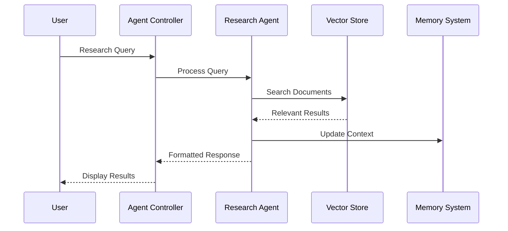
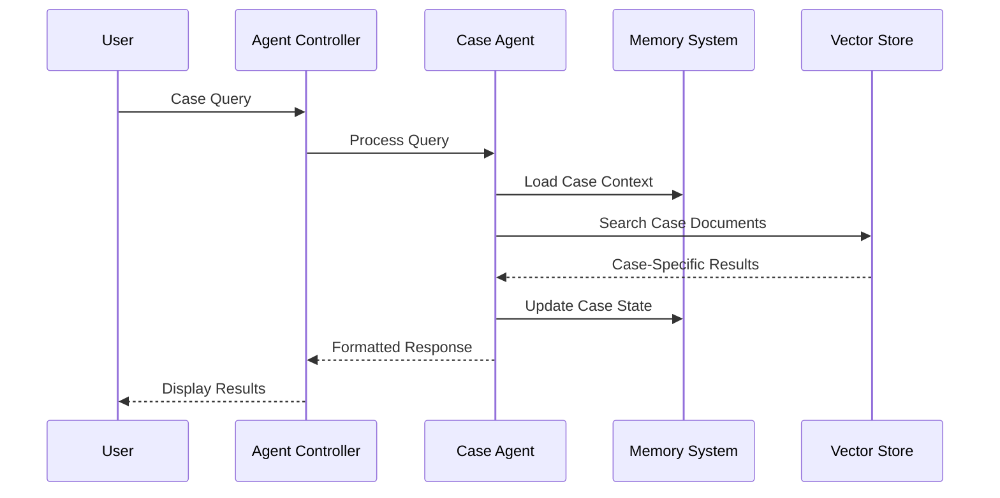

# Agent Workflow and Architecture

## Core Components

### 1. Agent Controller
- **Purpose**: Central orchestrator for all agent activities
- **Responsibilities**:
  - Mode switching (Research/Case)
  - Context management
  - State synchronization
  - Message routing

### 2. Research Agent
- **Purpose**: Handles legal research and document analysis
- **Capabilities**:
  - Document search and analysis
  - Citation extraction
  - Legal precedent matching
  - Contract drafting assistance
  - Source verification

### 3. Case Agent
- **Purpose**: Manages case-specific operations
- **Capabilities**:
  - Case context tracking
  - Document organization
  - Timeline management
  - Client information handling
  - Case-specific contract drafting

### 4. Memory System
- **Short-term**: Current conversation context
- **Long-term**: Previous cases and research
- **Vector Store**: Semantic search capabilities
- **Document Store**: File management

## Workflow Sequences

### 1. Research Mode Flow

### 2. Case Mode Flow

## State Management

### 1. Global State
- Current mode (Research/Case)
- User preferences
- Authentication state
- Active case/research context

### 2. Local State
- Chat history
- Document cache
- UI state
- Form data

### 3. Persistent State
- Case records
- Document metadata
- User settings
- Search history

## Integration Points

### 1. External Services
- **VectorDB (Redis)**:
  - Document embeddings
  - Semantic search
  - Context storage

- **Backend (Supabase)**:
  - User management
  - Document storage
  - Case management
  - Activity logging

### 2. AI Models
- **Text Generation**: Response creation
- **Document Analysis**: Content extraction
- **Classification**: Query routing
- **Embedding**: Semantic search

## Error Handling

### 1. Recovery Strategies
- Automatic retry for transient failures
- Graceful degradation
- State rollback capabilities
- User feedback mechanisms

### 2. Error Types
- Network failures
- Model errors
- Rate limiting
- Data validation

## Performance Optimizations

### 1. Caching Strategy
- Response caching
- Document caching
- Embedding caching
- Context memoization

### 2. Load Management
- Request batching
- Lazy loading
- Progressive enhancement
- Resource pooling

## Security Measures

### 1. Data Protection
- End-to-end encryption
- Secure storage
- Access control
- Audit logging

### 2. User Safety
- Content filtering
- Rate limiting
- Input validation
- Output sanitization 